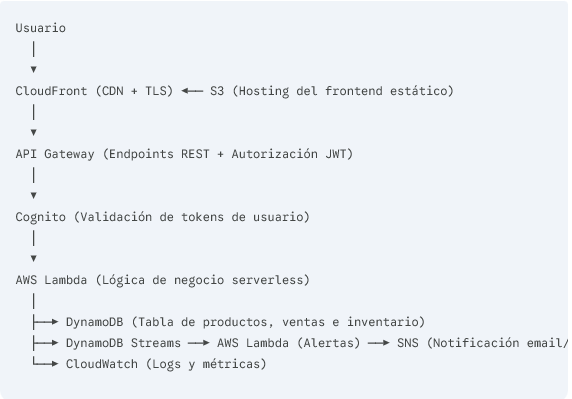

Diagrama:

consultar: diagrams/arquitectura-aws.png

Flujo de tráfico:

Servicios y justificacion:

| Servicio  | Rol |   Por que?   |
| :---- | :----: | ----: |
| AWS LAMBDA |Cómputo serverless  | Ejecuta el código de negocio solo cuando hay peticiones, con escalado automático y costo cero en reposo. |
| Amazon DynamoDB|  Base de datos NoSQL| Ofrece latencia de un solo dígito de milisegundo y transacciones atómicas para controlar el stock de forma segura. |
|Amazon API Gateway | Punto de entrada REST API |  Gestiona los endpoints, limita el tráfico (throttling) y valida la autenticación|
| Amazon Cognito | Autenticación y control de acceso |Maneja el registro, inicio de sesión de usuarios y emisión de tokens JWT de forma segura.  |
|Amazon CloudFront |  CDN|Distribuye la aplicación web globalmente, reduce la latencia y gestiona los certificados HTTPS/TLS en el edge.  |
| Amazon S3 | Almacenamiento de assets estáticos |  Aloja la interfaz gráfica (HTML/CSS/JS) con alta disponibilidad y bajo costo.|
| DynamoDB Streams |  Captura de datos en tiempo real| Dispara eventos automáticos al modificar registros de inventario para evaluar niveles mínimos de stock. |
| Amazon SNS | Notificaciones |  Envía alertas automáticas por correo electrónico o push cuando un producto requiere reabastecimiento.|
|  Amazon CloudWatch|  Monitoreo y trazabilidad| Centraliza los logs de ejecución de las funciones Lambda y registra métricas del sistema. |

