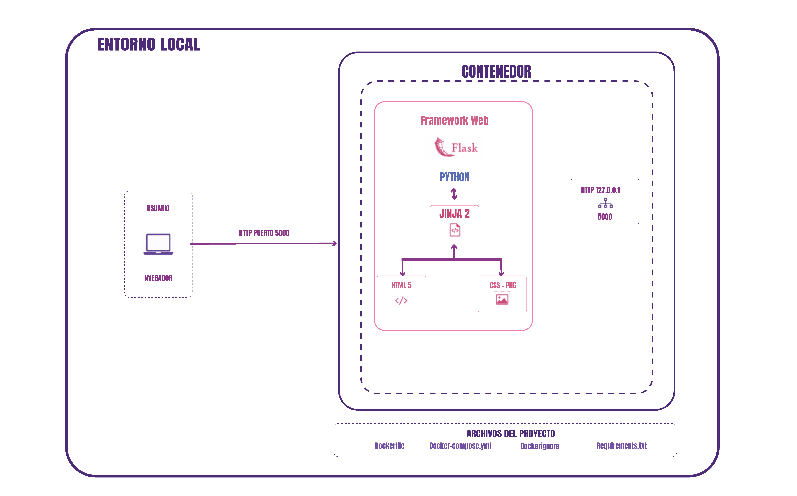

# Arquitectura local

## Descripción

Aplicación web desarrollada con Python y Flask. 
La interfaz se renderiza mediante Jinja2, utilizando plantillas HTML y archivos CSS estáticos.

El proyecto fue preparado para ejecutarse mediante Docker utilizando un `Dockerfile` y un archivo `docker-compose.yml`, los cuales definen el entorno de ejecución de la aplicación. Durante el desarrollo también puede ejecutarse localmente utilizando el entorno virtual de Python.

Arquitectura local
