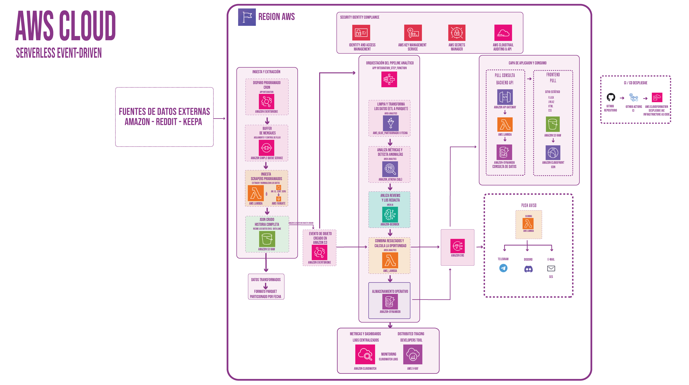

# Arquitectura AWS

## Descripción

Radar Tracker implementa una arquitectura **serverless orientada a eventos** sobre AWS para detectar oportunidades comerciales a partir de fuentes externas como Amazon, Reddit y Keepa.

El procesamiento se encuentra desacoplado mediante eventos y servicios administrados, permitiendo escalar cada componente de forma independiente y reduciendo la administración de infraestructura.

## Flujo de la arquitectura

El proceso comienza con un disparo programado mediante Amazon EventBridge, que inicia la ejecución de los procesos de ingesta.

Los mensajes son almacenados temporalmente en Amazon SQS, que actúa como buffer para absorber picos de carga antes de la ejecución de los scrapers implementados con AWS Lambda o AWS Fargate, según el volumen de procesamiento requerido.

Los datos obtenidos se almacenan en Amazon S3 como repositorio central de datos. Posteriormente, AWS Glue transforma los archivos al formato **Parquet particionado por fecha, optimizando las consultas analíticas realizadas mediante Amazon Athena.

Las reseñas obtenidas son analizadas por Amazon Bedrock, que identifica problemas frecuentes, tendencias y oportunidades de mejora utilizando modelos de inteligencia artificial.

Una función AWS Lambda combina los resultados analíticos y calcula el Opportunity Score, almacenando la información operativa en Amazon DynamoDB.

Las oportunidades son consultadas por la aplicación mediante Amazon API Gateway, mientras que Amazon SNS distribuye notificaciones hacia distintos canales como Telegram, Discord o correo electrónico.

El monitoreo de la solución se realiza mediante Amazon CloudWatch, mientras que AWS IAM, AWS KMS, AWS Secrets Manager y AWS CloudTrail proporcionan control de acceso, protección de secretos, cifrado y auditoría.

## Servicios AWS utilizados

| Servicio | Función |
|----------|---------|
| Amazon EventBridge | Programación de la ingesta |
| Amazon SQS | Buffer de mensajes |
| AWS Lambda | Procesamiento y lógica de negocio |
| AWS Fargate | Scrapers de mayor volumen |
| Amazon S3 | Almacenamiento del Data Lake |
| AWS Glue | Transformación de datos a Parquet |
| Amazon Athena | Consultas analíticas |
| Amazon Bedrock | Análisis mediante IA |
| Amazon DynamoDB | Almacenamiento operativo |
| Amazon API Gateway | Exposición de la API |
| Amazon SNS | Envío de notificaciones |
| Amazon CloudWatch | Monitoreo y métricas |
| AWS IAM | Gestión de identidades y permisos |
| AWS KMS | Cifrado de datos |
| AWS Secrets Manager | Administración de credenciales |
| AWS CloudTrail | Auditoría de acciones |

## Diagrama de arquitectura AWS

03 - Arquitectura serverless orientada a eventos del proyecto.