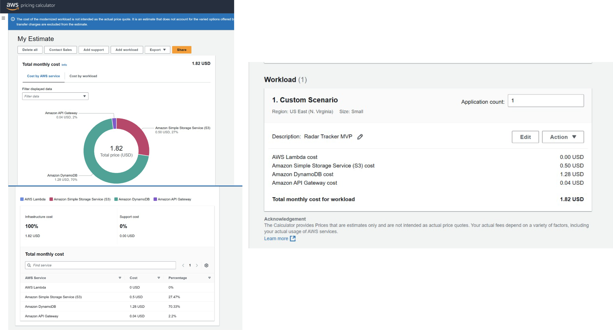

# Estimación de costos

## Objetivo

Con el fin de evaluar la viabilidad económica de la propuesta, realicé una estimación de costos utilizando AWS Pricing Calculator para los servicios disponibles.

## Supuestos de la estimación

Para realizar la estimación se consideró el siguiente escenario:

- Región AWS: US East (N. Virginia)
- Arquitectura serverless.
- Bajo volumen de usuarios.
- Procesamiento programado de oportunidades.
- Almacenamiento inicial de 20 GB en Amazon S3.
- Base de datos Amazon DynamoDB de 5 GB.
- API pública mediante Amazon API Gateway.

## Resultado de la estimación

| Servicio | Costo mensual |
|----------|--------------:|
| AWS Lambda | USD 0.00 |
| Amazon S3 | USD 0.50 |
| Amazon DynamoDB | USD 1.28 |
| Amazon API Gateway | USD 0.04 |
| **Costo mensual estimado** | **USD 1.82** |

### Resultado de la estimación

## Consideraciones

La modalidad simplificada de AWS Pricing Calculator utilizada durante la estimación no permite configurar algunos servicios de la arquitectura, como AWS Glue, Amazon Athena, Amazon Bedrock, Amazon EventBridge, Amazon SNS, Amazon SQS y Amazon CloudWatch.

Por este motivo, la estimación presentada representa el costo del núcleo de la aplicación y constituye una aproximación para un escenario de baja demanda (MVP). En un entorno productivo, el costo total dependerá del volumen de datos procesados, la cantidad de consultas analíticas, el consumo de modelos de inteligencia artificial y el tráfico generado por la aplicación.

## Conclusión

La estimación obtenida demuestra que el núcleo de la aplicación puede ejecutarse con un costo mensual reducido durante la etapa inicial del proyecto. Gracias al uso de servicios administrados y serverless, la solución puede escalar de manera progresiva sin necesidad de mantener infraestructura dedicada.

