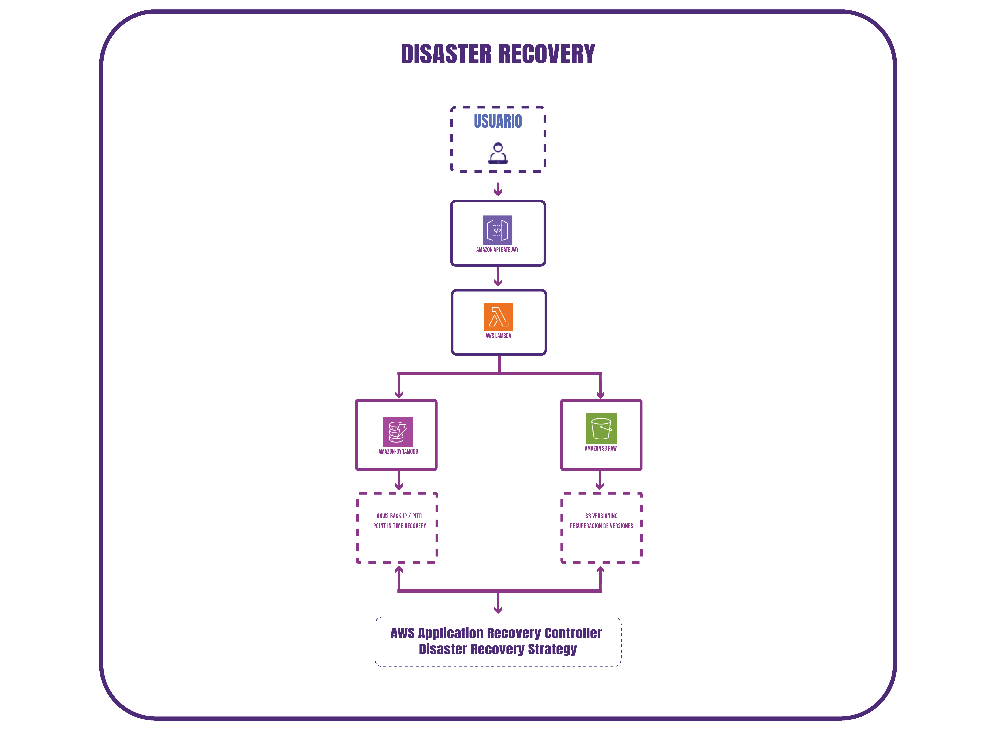

# Recuperación ante desastres (Disaster Recovery)

## Objetivo

La arquitectura de Radar Tracker utiliza servicios administrados de AWS para garantizar la disponibilidad de la aplicación y reducir la pérdida de información ante una falla.

## Estrategia de recuperación

La recuperación del sistema se basa en los siguientes mecanismos:

- **Amazon S3:** Versioning y posibilidad de habilitar Cross-Region Replication (CRR).
- **Amazon DynamoDB:** Copias de seguridad mediante AWS Backup y Point-in-Time Recovery (PITR).
- **AWS Lambda:** Recuperación automática de las funciones sin estado.
- **Amazon CloudWatch:** Monitoreo y generación de alertas ante errores.

## Diagrama de recuperación

Estrategia de recuperación de la arquitectura.

## Objetivos de recuperación

| Objetivo | Valor        |
| **RPO**  | < 15 minutos |
| **RTO**  | < 30 minutos |

## Conclusión

La utilización de servicios administrados y serverless permite recuperar la aplicación rápidamente y minimizar la pérdida de información ante fallas operativas.