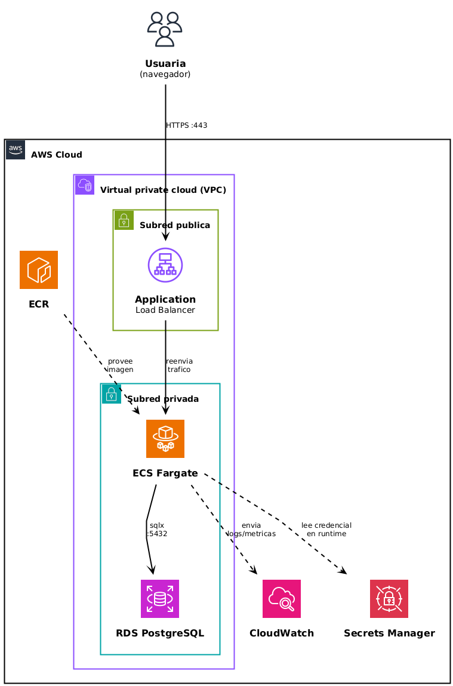

# 03 · Propuesta de arquitectura en AWS

## Servicios utilizados en la solucion de arquitectura

| Servicio                     | Para qué serviría                                            |
| ----------------------------- | -------------------------------------------------------------- |
| **Amazon ECR**                | Guarda la imagen Docker de la app (la que construye tu `Dockerfile`) |
| **Amazon ECS (Fargate)**      | para correr el contenedor de la app sin administrar servidores      |
| **Amazon RDS for PostgreSQL** | Reemplazo administrado del contenedor `db` de mi `docker-compose.yml` |
| **Application Load Balancer** | Recibir el tráfico HTTP y repartirlo entre las tareas de ECS   |
| **Amazon CloudWatch**         | Logs y métricas de la app y de la base de datos                 |
| **AWS Secrets Manager**       | Guardar la `DATABASE_URL` / credenciales de Postgres, en vez de tenerlas en texto plano |
| **Amazon VPC**                | Red privada: la base de datos no expuesta a internet, solo accesible desde ECS |

## Preguntas para armar tu justificación

**Amazon ECR:** Lo elijo porque necesito un lugar donde guardar la imagen que ya construyo con mi Dockerfile local. Es el paso natural entre "en mi maquina funciona" y "puedo desplegarla en AWS" — sin ECR, ECS no tiene de dónde traer la imagen.

**Amazon ECS con Fargate:** Fargate en vez de EC2 porque no quiero administrar servidores por mi cuenta (parchear el SO, dimensionar instancias, etc.) para una app de bajo tráfico y un solo usuario, Fargate me deja correr el mismo contenedor que ya tengo funcionando localmente, pagando solo por lo que uso, sin la complejidad operativa de EC2. Descarté Lambda porque mi app es un servidor Actix-web de larga duración (long-running), no funciones stateless de corta ejecución — no encaja bien con el modelo serverless de Lambda.

**Amazon RDS for PostgreSQL:** Es el reemplazo administrado de mi contenedor db. Elijo RDS en vez de seguir con Postgres en un contenedor porque me da backups automáticos (coherente con la estrategia de Backup & Restore que definí en mi plan de disaster recovery), parches de seguridad automáticos y no tengo que preocuparme por la persistencia de datos en un volumen que yo misma administro. Como soy la única usuaria, elijo una instancia chica (ej: db.t4g.micro) sin Multi-AZ, porque no se justifica el costo extra de alta disponibilidad para mi caso de uso.

**Application Load Balancer** Recibe el tráfico HTTP externo y lo dirige hacia la tarea de ECS. Lo necesito porque las tareas de Fargate no tienen una IP fija estable a la que apuntar directamente desde internet. Accedo a la app con la URL propia que da el Load Balancer, sin dominio personalizado — para un solo usuario no me pareció necesario agregar Route 53 ni un certificado propio con ACM; prioricé simplicidad y costo por sobre eso.

**Amazon CloudWatch** Lo uso para tener logs y métricas centralizadas de la app y de RDS. Sin esto, si algo falla no tendría forma de diagnosticar qué pasó una vez desplegado en AWS (a diferencia de local, donde puedo ver la consola directamente).

**AWS Secrets Manager** Hoy mi DATABASE_URL está en texto plano en el docker-compose.yml — en AWS no quiero repetir esa mala práctica. Secrets Manager me permite que ECS inyecte la credencial de forma segura en tiempo de ejecución, sin que quede hardcodeada en ningún archivo de configuración ni en el código.

**Amazon VPC:** La necesito para que RDS quede en una subred privada, sin IP pública — solo accesible desde las tareas de ECS. Así reduzco la superficie de ataque: nadie puede conectarse directamente a mi base de datos desde internet, solo mi propia app puede hacerlo.

## Diagrama

