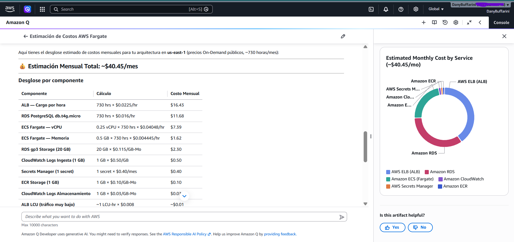
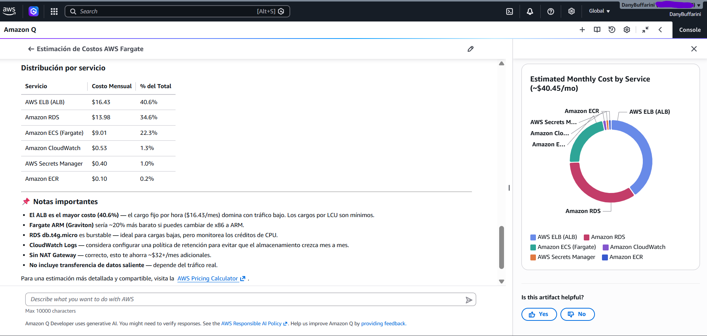

# 05 · Estimación de costos

Uso: [AWS Pricing Calculator](https://calculator.aws/) con los servicios descriptos en  `03-arquitectura-aws.md` .

**Costo estimado:** aproximadamente USD 54/mes, considerando una única tarea ECS Fargate ejecutándose 24/7, una instancia RDS PostgreSQL db.t4g.micro Single-AZ con 20 GB gp3, un Application Load Balancer, ECR, Secrets Manager y un volumen bajo de logs en CloudWatch. La estimación corresponde a precios On-Demand de us-east-1 y no contempla NAT Gateway, transferencia significativa de datos ni impuestos.

## Estimación mensual (borrador)

Estoy suponiendo:

1 tarea ECS Fargate 24/7
0,25 vCPU
0,5 GB RAM
Linux/x86
RDS PostgreSQL db.t4g.micro
Single-AZ
20 GB gp3
1 Application Load Balancer
tráfico muy bajo
1 repositorio ECR con ~1 GB
1 secret
~1 GB/mes de logs de CloudWatch
sin NAT Gateway

AWS cobra Fargate por vCPU y memoria utilizados; para us-east-1, los precios publicados son $0,000011244 por vCPU-segundo y $0,000001235 por GB-segundo para Linux/x86

## Ejercicio de Estimación mensual

| Servicio                      | Supuesto                  |   USD/mes aprox. |
| ----------------------------- | ------------------------- | ---------------: |
| **ALB ** — Cargo por hora     |	730 hrs × $0.0225/hr	    |  $16.43          |
| **RDS PostgreSQL**            | `db.t4g.micro`, Single-AZ |       **$11,68** |
| **ECS Fargate** |vCPU	0.25 vCPU × 730 hrs × $0.04048/hr	|          $7.39   |
| **ECS Fargate** |Memoria	0.5 GB × 730 hrs × $0.004445/hr	|          $1.62   |
| RDS Storage                   | 20 GB gp3                 |        **$2,30** |
| **Application Load Balancer** | 730 h + ~1 LCU            |       **$22,27** |
| IPv4 públicas del ALB         | 2 × $0,005/h              |        **$7,30** |
| **ECR**                       | 1 GB                      |        **$0,10** |
| **Secrets Manager**           | 1 secret                  |        **$0,40** |
| **CloudWatch**                | ~1 GB logs                |        **$0,50** |
| **TOTAL**                     |                           | **≈ $40,45/mes** |

## Servicios más costosos de tu arquitectura

El ALB es relativamente caro para una aplicación diminuta:
Es decir, más de la mitad del costo está en ALB + IPv4, no en ECS ni RDS.
Aun con poco tráfico, el ALB está encendido 24/7. 
AWS cobra sus horas de funcionamiento independientemente de que reciba pocas solicitudes.

## Decisiones para optimizar costos

> Es importante decidir correctamente el tipo de instancia. Con una instancia `db.t4g.micro` de RDS alcanza.

## Qué evitarías o simplificarías en una primera versión

> en una primer version arranca sin Multi-AZ, sin CDN, con una sola instancia de ECS sin
> auto scaling. Se agrega en una siguiente version si el uso lo justifica.

## Ejercicio: estimacion con Amazon Q 

