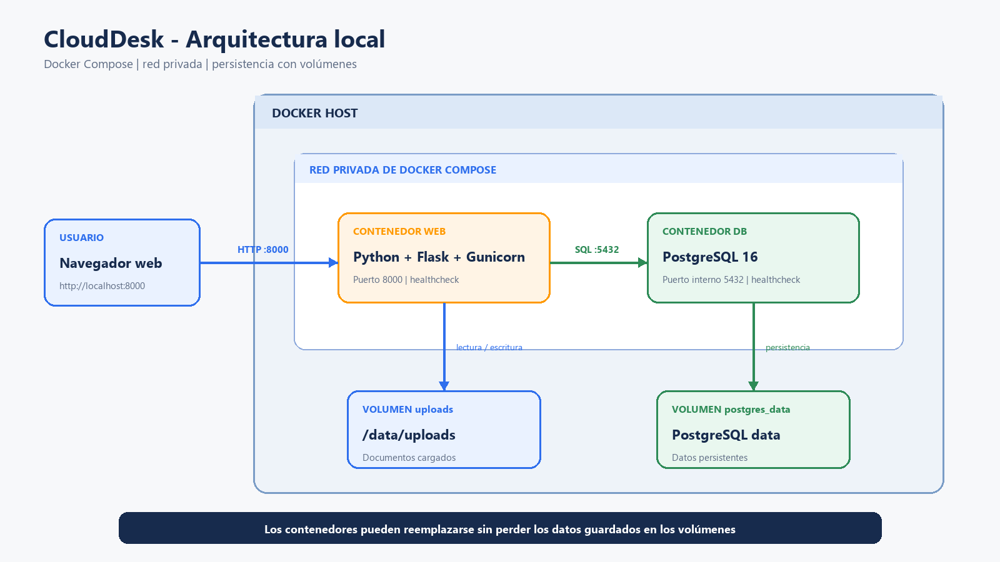
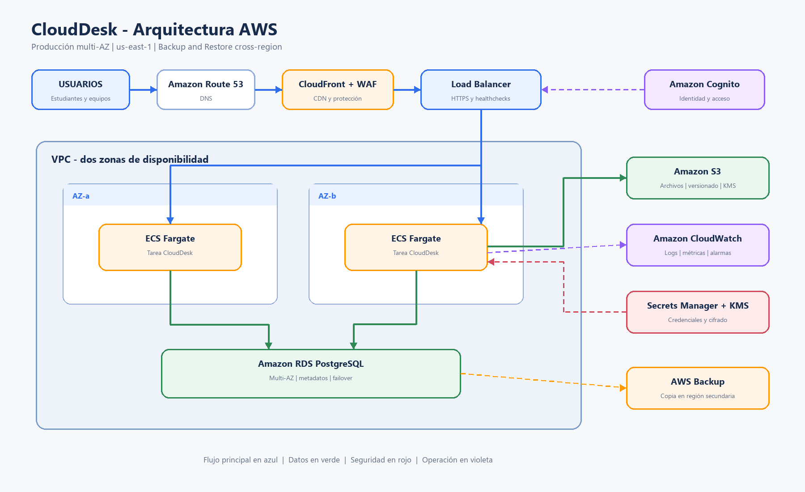
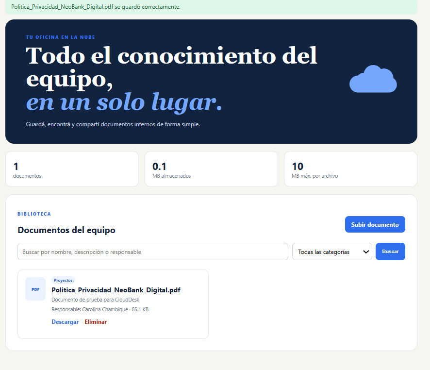
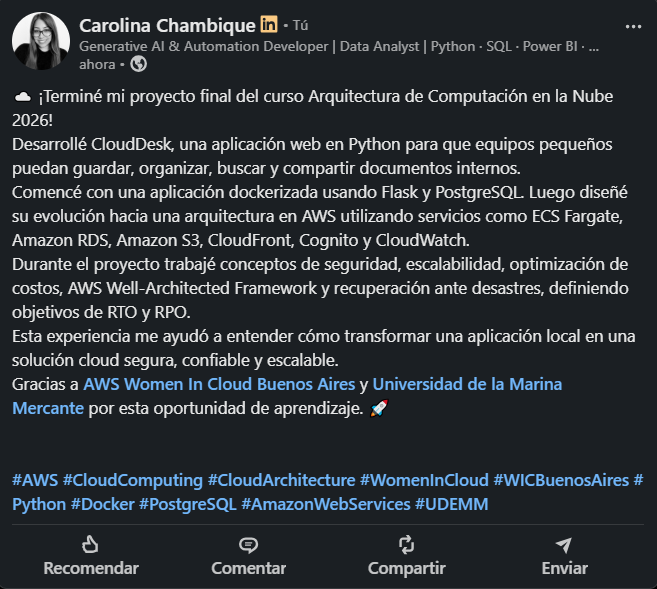

# CloudDesk — Carolina Chambique

Trabajo práctico final del curso **Arquitectura de Computación en la Nube 2026**.

## Descripción

CloudDesk es una aplicación web para organizar, conservar y compartir documentos entre estudiantes, compañeros de trabajo y equipos de proyectos.

La aplicación permite:

- Subir documentos.
- Asignar una categoría.
- Indicar una persona responsable.
- Agregar una descripción.
- Buscar y filtrar archivos.
- Descargar documentos.
- Eliminar documentos.
- Consultar el espacio utilizado.
- Verificar el estado de la aplicación y la base de datos.

## Motivación personal

Elegí crear CloudDesk a partir de una experiencia personal.

Cuando perdí el acceso a mi cuenta universitaria, también perdí los archivos que tenía almacenados en Drive y no pude recuperarlos.

Esa situación me hizo pensar en la importancia de contar con una aplicación que permita organizar documentos, compartirlos con otras personas y recuperarlos si se eliminan o modifican por error.

## Tecnologías utilizadas

### Aplicación local

- Python 3.12.
- Flask.
- Gunicorn.
- PostgreSQL 16.
- Docker.
- Docker Compose.
- HTML y CSS.

### Arquitectura propuesta en AWS

- Amazon ECS con Fargate.
- Amazon ECR.
- Amazon S3.
- Amazon RDS for PostgreSQL.
- Application Load Balancer.
- Amazon Cognito.
- Amazon CloudFront.
- AWS WAF.
- Amazon CloudWatch.
- AWS Secrets Manager.
- AWS KMS.
- AWS Backup.
- Route 53.

## Arquitectura local

Docker Compose levanta dos servicios:

- `web`: aplicación Python con Flask y Gunicorn.
- `db`: base de datos PostgreSQL.

La aplicación utiliza dos volúmenes:

- `uploads`: conserva los documentos cargados.
- `postgres_data`: conserva los datos de PostgreSQL.

El navegador se conecta con CloudDesk mediante el puerto `8000`.



## Arquitectura AWS

En AWS, la aplicación se ejecutaría en contenedores administrados por ECS Fargate.

Los archivos se guardarían en Amazon S3 y sus metadatos se almacenarían en Amazon RDS for PostgreSQL.

Elegí S3 porque permite guardar objetos, activar versionado y recuperar documentos eliminados o modificados por error.

Elegí PostgreSQL en RDS porque ya tengo experiencia utilizando PostgreSQL y porque RDS reduce el trabajo de mantenimiento de la base de datos.

Elegí ECS Fargate porque permite ejecutar contenedores sin administrar servidores. Durante el curso también vimos EC2 y Elastic Beanstalk, pero para CloudDesk prefiero concentrarme en la aplicación y no en el mantenimiento de instancias.



## Cómo ejecutar CloudDesk

### Requisitos

- Docker Desktop.
- Docker Compose.
- Puerto `8000` disponible.

### Ejecución

Desde la carpeta de la aplicación:

```bash
cd Entregables/carolina-chambique/app
docker compose up --build
```

Cuando los contenedores estén listos, abrir:

```text
http://localhost:8000
```

El estado de la aplicación puede verificarse en:

```text
http://localhost:8000/health
```

Para detener los contenedores:

```bash
docker compose down
```

Los datos permanecerán almacenados en los volúmenes.

Para eliminar también los datos locales:

```bash
docker compose down -v
```

Este último comando debe utilizarse con cuidado porque elimina los documentos y la base de datos local.

## Pruebas

Las pruebas automatizadas se encuentran en `app/tests`.

Para ejecutarlas sin Docker:

```bash
cd Entregables/carolina-chambique/app
python -m pip install -r requirements-dev.txt
python -m pytest -q
```

## Estructura de la entrega

```text
carolina-chambique/
├── app/
│   ├── static/
│   ├── templates/
│   ├── tests/
│   ├── uploads/
│   ├── app.py
│   ├── Dockerfile
│   ├── docker-compose.yml
│   └── requirements.txt
├── diagrams/
│   ├── arquitectura-local.png
│   └── arquitectura-aws.png
├── docs/
│   ├── 01-descripcion.md
│   ├── 02-arquitectura-local.md
│   ├── 03-arquitectura-aws.md
│   ├── 04-well-architected.md
│   ├── 05-costos.md
│   └── 06-disaster-recovery.md
├── evidence/
│   ├── app-running.png
│   └── linkedin-post.png
└── README.md
```

## Decisiones principales

- Separar los archivos de sus metadatos.
- Guardar los archivos en S3 y los metadatos en PostgreSQL.
- Usar contenedores para mantener un entorno consistente.
- Utilizar Fargate para evitar administrar servidores.
- Aplicar versionado y backups para evitar la pérdida definitiva de documentos.
- Priorizar la disponibilidad, pero comenzar con una arquitectura acorde al presupuesto.
- Utilizar RDS Multi-AZ y dos tareas ECS en producción.
- Utilizar una estrategia Backup and Restore ante un desastre regional.

## Objetivos de recuperación

Para fallas de un contenedor o una zona:

- RTO: 10 minutos.
- RPO: 5 minutos.

Para un desastre regional completo:

- RTO: 4 horas.
- RPO: 1 hora.

## Costos estimados

- Primera versión económica: aproximadamente USD 35–60 mensuales.
- Arquitectura productiva pequeña: aproximadamente USD 110–145 mensuales.

Los valores son orientativos y deben actualizarse en AWS Pricing Calculator antes de realizar un despliegue real.

## Evidencias

### CloudDesk funcionando



### Publicación en LinkedIn



## Autora

**Carolina Chambique**

Proyecto final — Arquitectura de Computación en la Nube 2026.