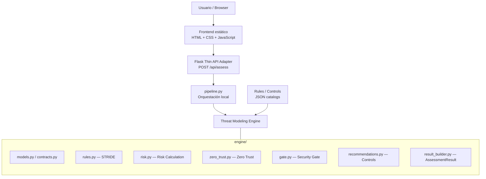
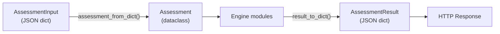
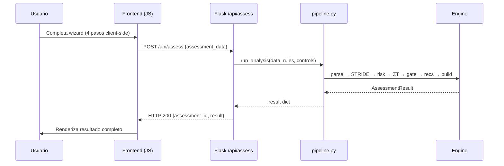

# 02 — Arquitectura local

## Visión general

La ejecución local de Secure Design Advisor utiliza Docker para empaquetar un frontend estático, un adaptador API mínimo en Flask, y el Threat Modeling Engine completo — sin base de datos, sin servicios externos y sin dependencias de infraestructura cloud.



## Componentes

### Frontend (`frontend/`)

| Aspecto | Detalle |
|---------|---------|
| Stack | HTML, CSS, JavaScript vanilla, Bootstrap 5 (CDN) |
| Ubicación | `app/frontend/` |
| UI | Wizard client-side de 4 pasos + pantalla de resultado |
| Estado | En memoria del browser (`assessmentData` object) |
| Comunicación | `POST /api/assess` con AssessmentInput canónico |

No utiliza Flask session ni Jinja. Construye el AssessmentInput completo en el browser y lo envía en un único request al finalizar el wizard.

### Flask Thin API Adapter (`src/local_api/app.py`)

| Aspecto | Detalle |
|---------|---------|
| Ruta target | `POST /api/assess` |
| Función | Recibir JSON, invocar `run_analysis()`, retornar AssessmentResult |
| Ruta frontend | `GET /app/*` → sirve archivos estáticos de `frontend/` |

No contiene lógica de Threat Modeling. Su única responsabilidad es transformar HTTP ↔ JSON para el engine.

### pipeline.py (`src/engine/pipeline.py`)

Orquesta la ejecución completa del análisis localmente:

```
Assessment dict → parse → evaluate_threats → calculate_risks
→ evaluate_zero_trust → determine_gate → resolve_recommendations
→ build_assessment_result → AssessmentResult
```

En AWS, esta responsabilidad será reemplazada por Step Functions. `pipeline.py` se mantiene porque:
- Ejecución local sin infraestructura cloud.
- Regression testing (pipeline == Lambda chain).
- Referencia funcional end-to-end.

### Threat Modeling Engine (`src/engine/`)

Core framework-agnostic. No conoce Flask, Lambda, HTTP ni infraestructura.

| Módulo | Responsabilidad |
|--------|----------------|
| `models.py` | Dataclasses Assessment, parsing canónico |
| `contracts.py` | Validación de input, serialización de output |
| `rules.py` | Carga de reglas, matching STRIDE |
| `risk.py` | Cálculo de riesgo con modificadores |
| `zero_trust.py` | Evaluación de 5 dimensiones ZT |
| `gate.py` | Decisión del Security Architecture Gate |
| `recommendations.py` | Resolución de controles AWS |
| `result_builder.py` | Construcción del AssessmentResult canónico |
| `pipeline.py` | Orquestación local end-to-end |
| `visualization.py` | Generación de nodos para diagrama de arquitectura |
| `exceptions.py` | Excepciones de dominio (ValidationError) |

12 módulos Python. 0 dependencias de framework.

### Catálogos de datos (`data/`)

| Archivo | Contenido |
|---------|-----------|
| `threat_rules.json` | 15 reglas STRIDE con condiciones, scores base, y referencia conceptual |
| `aws_controls.json` | 14 controles AWS con requisito, servicio y explicación |
| `zero_trust_rules.json` | 5 dimensiones de evaluación con criterios |

Los catálogos son externos al código. Editables sin modificar el engine.

## Contratos de datos



Este desacoplamiento permite que frontend, Flask, Lambda, y tests utilicen exactamente la misma interfaz sin conocer la implementación interna.

## Docker

### Dockerfile

```dockerfile
FROM python:3.11-slim
RUN useradd -m -r appuser
WORKDIR /app
COPY requirements.txt .
RUN pip install --no-cache-dir -r requirements.txt
COPY src/ src/
COPY data/ data/
COPY frontend/ frontend/
ENV PYTHONPATH=/app/src
USER appuser
EXPOSE 5000
CMD ["gunicorn", "--bind", "0.0.0.0:5000", "--chdir", "src/local_api", "app:app"]
```

| Decisión | Justificación |
|----------|---------------|
| `python:3.11-slim` | Imagen mínima, menor superficie de ataque |
| Non-root user | Security by Design aplicado a la propia herramienta |
| Gunicorn | Production-grade WSGI server |
| Puerto 5000 | Consistente con desarrollo local |
| PYTHONPATH | Permite imports de `engine.*` desde cualquier módulo |

### docker-compose.yml

```yaml
services:
  app:
    build: .
    ports:
      - "5000:5000"
    environment:
      - SECRET_KEY=dev-only-not-for-production
      - PYTHONPATH=/app/src
```

Servicio único. Sin base de datos. Sin Redis. Sin nginx.

### Estado de Docker

| Artefacto | Estado |
|-----------|--------|
| Dockerfile | ✅ Definido, paths validados estáticamente |
| docker-compose.yml | ✅ Definido |
| `docker compose up` real | ⏳ Validación manual pendiente |

### Cómo ejecutar

```bash
cd Entregables/gabriela-moya/app
docker compose up --build
# Abrir: http://localhost:5000/app/
```

## Flujo de ejecución



Un único round-trip al backend. Sin ida y vuelta entre pasos del wizard.

## Testing local

| Suite | Cobertura | Tests |
|-------|-----------|-------|
| Engine (rules, risk, gate, ZT, recs) | Lógica de dominio | 72 |
| Lambda handlers + equivalence | Adaptadores + paridad pipeline | 27 |
| DynamoDB schema | Modelo de persistencia | 17 |
| API endpoint + frontend serving | Flask adapter | 9 |
| Infrastructure (ASL + template) | Validación estática IaC | 21 |
| Contracts + roundtrip | Serialización, parsing | 13 |
| **Total** | | **159** |

Test clave de equivalencia:

```
run_analysis(input) == Validate → Threat → Risk → BuildResult (Lambda chain)
```

Esto demuestra que reemplazar `pipeline.py` por Step Functions + Lambda no modifica el resultado funcional.

## Caso API Proveedores — ejecución local

Validado mediante Flask test client y endpoint `/api/assess`:

- Findings: 4 (Elevation of Privilege, DoS, 2× Information Disclosure)
- Overall risk: Critical
- Gate: REQUIERE REVISIÓN DE ARQUITECTURA DE SEGURIDAD
- Zero Trust: 60%
- Recommendations: 4

## Componentes transitorios

Actualmente presentes pero **no forman parte de la arquitectura local target**:

| Componente | Ubicación | Motivo de permanencia |
|-----------|-----------|----------------------|
| Jinja templates | `src/local_api/templates/` | Fallback hasta validar browser E2E |
| Flask session | `src/local_api/app.py` (rutas legacy) | Wizard server-side como fallback |
| Rutas wizard (`/assessment/*`) | `src/local_api/app.py` | Compatibilidad temporal |

Estos componentes no se representan en los diagramas principales. Serán retirados una vez confirmada la paridad funcional del frontend estático.

## Comparación: Local vs AWS

| Aspecto | Local | AWS |
|---------|-------|-----|
| Frontend hosting | Flask sirve archivos estáticos | CloudFront + S3 |
| API transport | Flask HTTP | API Gateway |
| Orquestación | `pipeline.py` (secuencial, mismo proceso) | Step Functions Express |
| Compute | Python directo | Lambda adapters |
| Persistencia | No (stateless) | DynamoDB |
| Engine | `src/engine/` | Mismo engine (Lambda Layer) |

El engine es idéntico en ambos entornos. Cambia hosting, transport, compute y orquestación.

## Trade-offs

| Ventaja | Trade-off |
|---------|-----------|
| Simple de ejecutar (`docker compose up`) | Pipeline corre en un solo proceso |
| Rápido para desarrollo y debugging | Sin escalado independiente de componentes |
| Pocas dependencias (Flask + Gunicorn) | No utiliza persistencia cloud |
| Mismo engine que producción | Flask adapter es específico del entorno local |
| Reproducible (Docker) | No demuestra resiliencia ni escalabilidad |
