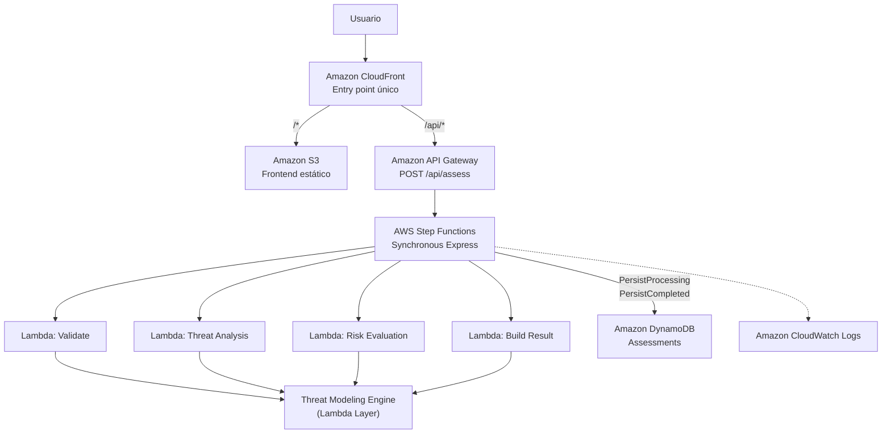
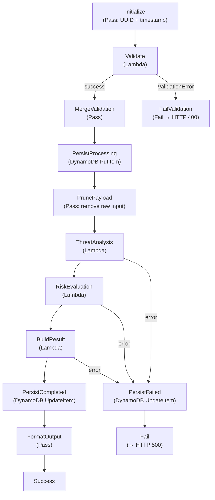
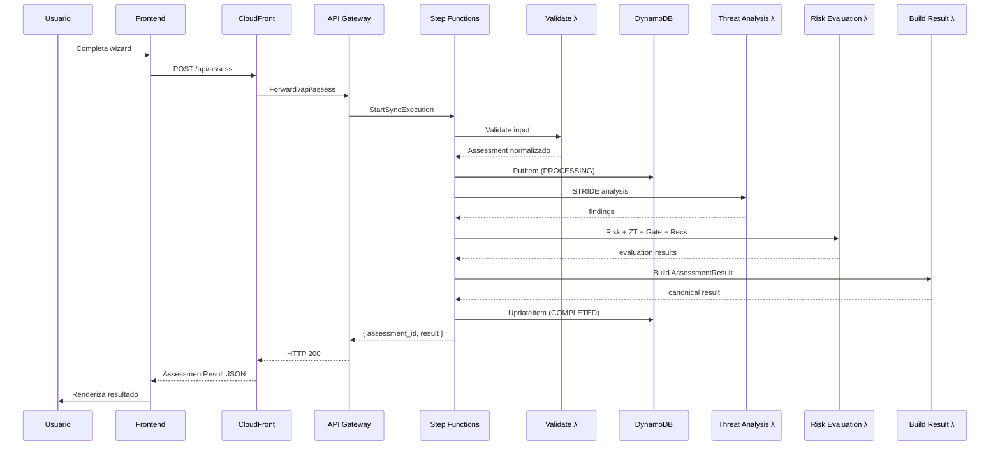

# 03 — Arquitectura AWS

## Visión general

Secure Design Advisor evoluciona desde una ejecución local basada en un pipeline Python hacia una **arquitectura serverless orientada a workflow** en AWS.

El Threat Modeling Engine permanece idéntico. Lo que cambia es el hosting, transporte, orquestación y persistencia.



## Servicios y justificación

| Servicio | Responsabilidad | Por qué se eligió |
|----------|----------------|-------------------|
| **CloudFront** | Entry point único, distribución frontend, routing por path | Una sola URL pública; caching para assets; separación frontend/API sin CORS |
| **S3** | Hosting del frontend estático (HTML/CSS/JS) | Bucket privado + OAC. Sin servidor web. Económico y resiliente |
| **API Gateway** | HTTP boundary para la API | Recibe POST /api/assess, invoca Step Functions. No contiene lógica |
| **Step Functions** | Orquestación del workflow de análisis | Workflow explícito, retries, catches, integración directa DynamoDB |
| **Lambda (×4)** | Adaptadores serverless del engine | Reutilizan el Threat Modeling Engine via Layer compartido |
| **DynamoDB** | Persistencia de assessments y resultados | PAY_PER_REQUEST, serverless, PITR, schema simple |
| **CloudWatch Logs** | Observabilidad del Express Workflow y Lambdas | Logging de cada transición de estado |

No se agregan servicios adicionales (WAF, Cognito, Route53) en el MVP.

## CloudFront — Routing

```
Browser: https://<distribution>/         → S3 (index.html)
Browser: https://<distribution>/app/...  → S3 (frontend assets)
Browser: POST /api/assess                → API Gateway
```

| Behavior | Origin | Métodos | Cache |
|----------|--------|---------|-------|
| `/*` (default) | S3 Frontend | GET, HEAD | CachingOptimized |
| `/api/*` | API Gateway | Todos (POST incluido) | CachingDisabled |

**OriginPath:** La origin de API Gateway incluye `/${Stage}` como OriginPath. Cuando CloudFront recibe `/api/assess`, envía la request a `{apigw-domain}/{stage}/api/assess`. Esto mapea correctamente al recurso definido en OpenAPI.

**S3 Access:** Bucket completamente privado. CloudFront accede mediante Origin Access Control (OAC) con sigv4.

## API Gateway

| Aspecto | Valor |
|---------|-------|
| Tipo | REST API (SAM::Api) |
| Stage | Configurable (default: `dev`) |
| Endpoint | `POST /api/assess` |
| Integración | StartSyncExecution sobre la State Machine |
| Autenticación | Sin auth en MVP (evolución: Cognito) |

La respuesta de StartSyncExecution se transforma mediante VTL:

| Status del workflow | HTTP Response | Body |
|--------------------|--------------|------|
| `SUCCEEDED` | 200 | `{ assessment_id, result: AssessmentResult }` |
| `FAILED` + `ValidationError` | 400 | `{ error: "validation_error", details }` |
| `FAILED` + otro error | 500 | `{ error: "processing_error", message }` |

## Step Functions — Workflow

### Por qué Step Functions

| Alternativa | Resultado |
|-------------|-----------|
| Lambda monolítica | Descartada: menos visibilidad, sin orquestación explícita |
| Lambda → Lambda | Descartada: orquestación dentro del compute |
| EventBridge/SQS | Descartada: innecesario para proceso síncrono determinístico |
| **Step Functions** | **Elegida**: workflow explícito, retries/catches, service integrations, separación orquestación/compute |

### Standard vs Express

| Criterio | Express (elegido) | Standard |
|----------|-------------------|----------|
| Duración | < 5 minutos | Hasta 1 año |
| Ejecución | Síncrona posible | Solo asíncrona |
| Historial | CloudWatch Logs | Execution history navegable |
| Costo | Por ejecución/duración | Por transición de estado |
| Nuestro caso | Análisis < 5 segundos ✅ | Sobradimensionado |

**Decisión:** Synchronous Express. El análisis completa en < 5 segundos. Frontend recibe respuesta directa sin polling.

### State Machine



**13 estados.** 4 Lambda Tasks + 3 DynamoDB integrations + 4 Pass + Succeed + Fail.

### State Envelope

El workflow acumula datos progresivamente sin destruir contexto:

| Después de | Contenido del envelope |
|------------|----------------------|
| Initialize | `assessment_id`, `created_at`, `input` |
| Validate + Merge | + `assessment` (normalizado) |
| PersistProcessing | Sin cambio (persiste externamente) |
| PrunePayload | **Elimina** `input` (ya persistido en DDB) |
| ThreatAnalysis | + `analysis.findings` |
| RiskEvaluation | + `evaluation.*` (risk, ZT, gate, recs) |
| BuildResult | + `build.result` (AssessmentResult) |
| FormatOutput | Output final: `{ assessment_id, result }` |

**Guardrail:** Payload ≤ 256 KiB por transición. Estimado actual: ~25 KB (10% del límite).

## Lambda adapters

| Lambda | Responsabilidad | Engine modules |
|--------|----------------|----------------|
| **Validate** | Validación, normalización | `contracts`, `models` |
| **Threat Analysis** | STRIDE rule matching | `rules` |
| **Risk Evaluation** | Risk + Zero Trust + Gate + Recommendations | `risk`, `zero_trust`, `gate`, `recommendations` |
| **Build Result** | Summaries, overall risk, viz, AssessmentResult | `result_builder`, `visualization` |

**No son microservicios.** Son unidades de ejecución serverless con alta cohesión que reutilizan el mismo Threat Modeling Engine.

### Por qué 4 y no 7 Lambdas

Se agruparon responsabilidades cohesionadas para evitar fragmentación. Risk Evaluation incluye Zero Trust, Gate y Recommendations porque:
- Comparten el mismo input (Assessment + findings).
- Su ejecución combinada toma < 100ms.
- Separar cada una generaría overhead de invocación sin beneficio funcional.

### Lambda Layer

```
/opt/python/engine/    ← 12 módulos Python (auto-importables)
/opt/data/             ← 3 JSON catalogs (DATA_DIR=/opt/data)
```

Generado por `infrastructure/prepare_layer.py` antes de `sam build`. Evita duplicar el engine en cada función.

## Flujo end-to-end



## Persistencia — DynamoDB

| Campo | Tipo | Momento |
|-------|------|---------|
| `assessment_id` | String (PK) | Initialize (States.UUID) |
| `status` | String | PROCESSING → COMPLETED \| FAILED |
| `created_at` | String ISO | Initialize |
| `updated_at` | String ISO | Cada update |
| `input` | String (JSON) | PersistProcessing |
| `result` | String (JSON) | PersistCompleted |
| `error` | Map | PersistFailed |
| `completed_at` | String ISO | PersistCompleted |
| `failed_at` | String ISO | PersistFailed |

**Direct service integration**: Step Functions escribe directamente a DynamoDB. Las Lambdas no tienen permisos de escritura.

**Tamaño:** Item estimado ~30 KB. Límite: 400 KB. Si crece → S3 + referencia (evolución futura).

## Error handling

| Escenario | Comportamiento | HTTP |
|-----------|---------------|------|
| Input inválido | Validate lanza ValidationError → FailValidation | 400 |
| Error post-persist | Catch → PersistFailed (DDB FAILED) → Fail | 500 |
| Lambda timeout | Retry (1 intento) → Catch → PersistFailed | 500 |
| Sin amenazas | Válido (0 findings, gate APROBADO) | 200 |

Requests inválidos no generan item en DynamoDB.

## IAM — Least privilege

| Principal | Permisos |
|-----------|----------|
| API Gateway Role | `states:StartSyncExecution` sobre la State Machine únicamente |
| State Machine Role | `lambda:InvokeFunction` (4 funciones), `dynamodb:PutItem/UpdateItem` (1 tabla), CloudWatch Logs |
| Lambda Roles | Ejecución básica + CloudWatch Logs. **Sin DynamoDB.** |
| CloudFront | OAC sobre S3 bucket |

## Seguridad de datos

| Mecanismo | Estado |
|-----------|--------|
| S3 Block Public Access | ✅ Configurado (4 flags) |
| CloudFront OAC (sigv4) | ✅ Definido en template |
| DynamoDB Point-in-Time Recovery | ✅ Habilitado |
| DynamoDB encryption at rest | AWS default (AES-256, managed key) |
| S3 encryption at rest | AWS default (SSE-S3) |
| HTTPS (CloudFront) | redirect-to-https |
| Lambda non-root | Runtime managed por AWS |

No se configura CMK propia. Los servicios utilizan encryption at rest por defecto.

## Escalabilidad

Todos los servicios son gestionados y escalan automáticamente:

| Servicio | Escalado |
|----------|----------|
| CloudFront | Global edge network |
| API Gateway | Managed, throttling configurable |
| Step Functions Express | Concurrency managed |
| Lambda | Concurrency automática (default 1000/región) |
| DynamoDB PAY_PER_REQUEST | On-demand capacity |

**Map State** no implementado. El volumen actual (6 componentes × 15 reglas) no justifica paralelismo. Evolución futura si componentes > 20.

## Trade-offs

| Decisión | Beneficio | Trade-off |
|----------|-----------|-----------|
| Synchronous Express | Frontend simple, sin polling | Menos historial que Standard |
| Lambda Layer | Engine compartido, sin duplicación | Packaging adicional (prepare_layer.py) |
| DynamoDB | Serverless, simple, PITR | Límite 400 KB por item |
| CloudFront multi-origin | Una sola URL, sin CORS | Configuración de behaviors |
| 4 Lambdas cohesionadas | Balance cohesión/granularidad | Más recursos que Lambda monolítica |
| Direct DynamoDB integration | Elimina Lambdas CRUD | ASL más complejo |
| Sin WAF/Cognito | Simplicidad MVP | Sin protección avanzada de API |

## Alternativas evaluadas y descartadas

| Alternativa | Motivo de descarte |
|-------------|-------------------|
| Flask/container en ECS Fargate | Innecesario para carga baja e irregular |
| Lambda monolítica | Menos visibilidad del workflow |
| Lambda → Lambda (orquestación interna) | Anti-pattern: acoplamiento de orquestación |
| 7 Lambdas (una por módulo) | Fragmentación innecesaria |
| Step Functions Standard | Sobradimensionado para < 5s |
| EventBridge/SQS | Innecesario para workflow síncrono |
| Map State | Volumen no lo justifica actualmente |
| Async + polling | Express sync es suficiente |

## Comparación: Local vs AWS

| Aspecto | Local | AWS |
|---------|-------|-----|
| Frontend | Flask sirve estáticos | CloudFront + S3 |
| API | Flask HTTP | API Gateway |
| Orquestación | `pipeline.py` | Step Functions Express |
| Compute | Python directo | Lambda adapters |
| Persistencia | No (stateless) | DynamoDB |
| Observabilidad | Logs consola | CloudWatch Logs |
| **Engine** | **src/engine/** | **Mismo engine (Layer)** |

## Estado de implementación

| Componente | Estado |
|-----------|--------|
| SAM template (15 recursos) | ✅ Definido, validado estáticamente |
| ASL State Machine (13 estados) | ✅ Definida, testeada |
| OpenAPI spec | ✅ Definida, validada |
| Lambda handlers (4) | ✅ Implementados, testeados |
| prepare_layer.py | ✅ Funcional |
| `sam build` / `sam validate` | ⏳ Requiere SAM CLI |
| Deployment AWS | ❌ No requerido por el curso |
| VTL response mapping runtime | ⏳ Requiere deployment |
| CloudFront live | ⏳ Requiere deployment |
