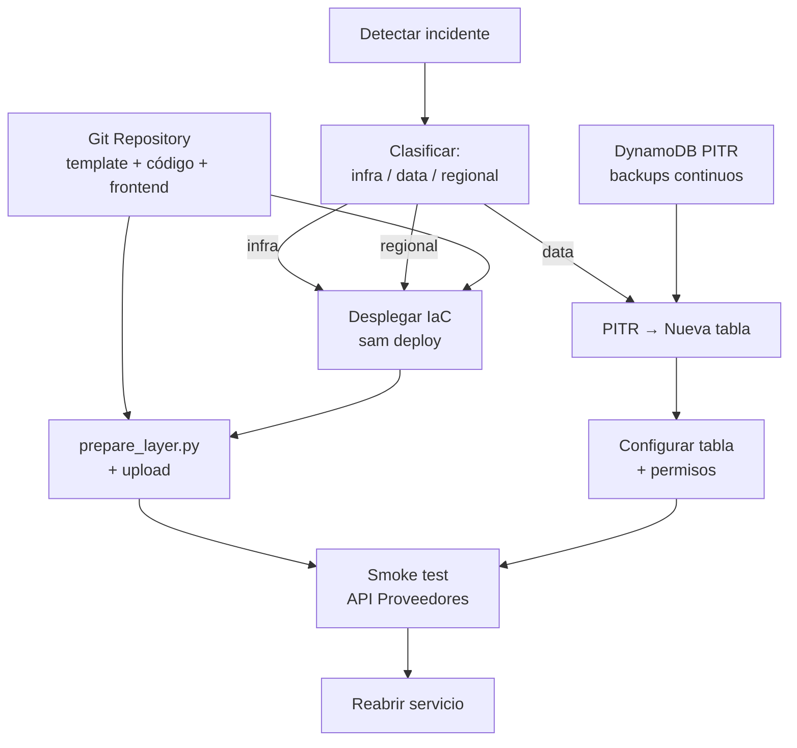

# 06 — Plan de recuperación ante desastres

## Contexto

Secure Design Advisor opera en una arquitectura serverless **single-region** (us-east-1). No implementa multi-region, warm standby ni failover automático. La estrategia de recuperación se basa en la capacidad de reconstruir la infraestructura desde código y restaurar datos desde backups continuos.

## Estrategia: Backup & Restore

Se adoptó Backup & Restore porque:

- La aplicación tiene criticidad académica/interna (no es un servicio crítico 24/7).
- Toda la infraestructura es reproducible mediante IaC (SAM template).
- Los componentes de compute son stateless (Lambda, Step Functions).
- El frontend es reconstruible desde el repositorio.
- DynamoDB es el único componente con estado de negocio, y tiene PITR habilitado.
- Mantener una segunda región activa agregaría complejidad y costo sin un requerimiento funcional que lo justifique actualmente.

## RTO y RPO propuestos

| Métrica | Target propuesto | Justificación |
|---------|-----------------|---------------|
| **RPO** | ≤ 5 minutos | DynamoDB PITR permite restaurar a cualquier segundo dentro de la ventana de recovery. La granularidad práctica depende del momento de detección. |
| **RTO** | 1–4 horas | Redeploy de infraestructura + restore DynamoDB + validación. Depende de disponibilidad del operador y herramientas. |

Estos son **targets propuestos, no medidos ni garantizados**. Un RTO/RPO real solo puede confirmarse después de ejecutar pruebas de recuperación.

## Estado y reconstruibilidad de cada componente

| Componente | ¿Estado de negocio? | Recuperación |
|-----------|---------------------|-------------|
| CloudFront | No | Recrear mediante IaC |
| S3 (frontend) | No (artefactos estáticos) | Redeploy desde `frontend/` |
| API Gateway | No (configuración) | Recrear mediante IaC |
| Step Functions | No (definición ASL) | Recrear mediante IaC |
| Lambda (×4) | No (código stateless) | Redeploy |
| Lambda Layer | No (artefacto reproducible) | `prepare_layer.py` + redeploy |
| **DynamoDB** | **Sí** (assessments y resultados) | **PITR → restore a nueva tabla** |
| CloudWatch Logs | No (observabilidad) | Se regeneran; no son datastore principal |
| IAM roles | No (configuración) | Recrear mediante IaC |

## DynamoDB Point-in-Time Recovery

El template define `PointInTimeRecoveryEnabled: true` para la tabla de assessments.

Características de PITR según documentación AWS:
- Backups continuos automáticos sin impacto en performance.
- Ventana de recuperación: hasta 35 días atrás (configuración AWS por defecto al habilitar PITR).
- Granularidad: por segundo dentro de la ventana.
- Restore crea una **tabla nueva** (no sobrescribe la existente).

Después del restore es necesario:
1. Validar integridad de los datos restaurados.
2. Actualizar referencias en el stack si el nombre de tabla cambió.
3. Reconfigurar permisos en la tabla nueva.
4. Habilitar PITR nuevamente en la tabla restaurada.

No existe failover automático. El restore es un proceso manual/operacional.

## Escenarios de falla

### A. Eliminación o corrupción de datos

```
Detectar → identificar recovery point → PITR restore → nueva tabla
→ validar datos → actualizar configuración → reanudar servicio
```

RTO estimado: 30-60 minutos (si el operador está disponible).

### B. Falla de una Lambda

```
Detectar error en logs → identificar causa → fix en código
→ prepare_layer.py → sam build → sam deploy
```

Datos no afectados. RTO: minutos si el fix es conocido.

### C. Error en State Machine o API Gateway

```
Corregir ASL/OpenAPI → sam deploy
```

Configuración declarativa. RTO: minutos.

### D. Pérdida del frontend bucket

```
Recrear bucket (IaC) → upload frontend/ → invalidar CloudFront cache
```

No hay datos de negocio en S3. RTO: minutos.

### E. Stack completo eliminado

```
sam deploy (template completo) → prepare_layer → deploy Lambdas
→ PITR restore DynamoDB → configurar tabla en stack → smoke test
```

RTO estimado: 1-4 horas.

### F. Falla regional completa

```
Seleccionar región alternativa → sam deploy en nueva región
→ PITR restore cross-region (si fue configurado) o aceptar pérdida
→ actualizar DNS/CloudFront (si existe custom domain)
→ validar
```

Actualmente **proceso manual**. No existe warm standby ni replicación automática.

## Diagrama de recuperación



## Runbook de recuperación

**Estado: PROPUESTO / NO PROBADO**

1. Confirmar el incidente y su alcance.
2. Preservar evidencia (logs, estado actual).
3. Si hay corrupción de datos: detener/restringir escrituras.
4. Identificar el último recovery point válido.
5. Desplegar infraestructura: `sam deploy` desde el template versionado.
6. Ejecutar `python infrastructure/prepare_layer.py`.
7. Build y deploy de Lambdas.
8. Si datos afectados: restaurar DynamoDB via PITR a recovery point.
9. Configurar la tabla restaurada en el stack (permisos, PITR).
10. Desplegar frontend a S3.
11. Ejecutar smoke test: caso API Proveedores via `/api/assess`.
12. Validar que el resultado sea correcto (4 findings, Gate REQUIERE REVISIÓN).
13. Si es válido, reabrir acceso al servicio.
14. Documentar el incidente y acciones tomadas.

## Dependencias de recuperación

La recuperación requiere disponibilidad de:

- Repositorio Git con código fuente actual.
- Template IaC versionado (`infrastructure/template.yaml`).
- Cuenta AWS con permisos de deployment.
- SAM CLI u herramienta equivalente de deployment.
- PITR habilitado y dentro de la ventana de recovery (35 días).
- `prepare_layer.py` y dependencias Python.

## Evolución por nivel

| Nivel | Estrategia | RTO aproximado | Costo adicional | Cuándo considerar |
|-------|-----------|---------------|-----------------|-------------------|
| 1 | **Backup & Restore** (actual) | 1–4 horas | Bajo (solo PITR) | Aplicación interna/académica |
| 2 | Pilot Light | 30–60 min | Medio (cross-region backups, IaC ready) | Usuarios regulares con tolerancia moderada |
| 3 | Warm Standby | 5–15 min | Alto (stack secundario desplegado) | Servicio con SLA definido |
| 4 | Active/Active | < 1 min | Muy alto (Global Tables, multi-region CF) | Servicio crítico 24/7 |

No se recomienda active-active para este caso de uso. La relación costo/beneficio no lo justifica dado el perfil de criticidad actual.

## Seguridad durante la recuperación

- Mantener IAM least privilege incluso en procedimientos de emergencia.
- No exponer temporalmente el bucket S3 como público durante redeploy.
- Validar permisos de la tabla restaurada antes de conectar al workflow.
- No usar backups como vía de bypass de controles de acceso.

## Detección de incidentes

Actualmente el template define CloudWatch Logs para el Express Workflow. No existen alarmas automatizadas configuradas.

Mejora recomendada (futuro):
- CloudWatch Alarms sobre error rate del workflow.
- Alerta cuando status FAILED supere un umbral.
- Notificación al operador ante indisponibilidad.

## Costo del DR

La estrategia Backup & Restore tiene costo incremental mínimo:
- DynamoDB PITR: $0.20/GB-mes sobre el almacenamiento existente.
- No requiere recursos permanentes en región secundaria.

Evolucionar a warm standby o active-active multiplicaría el costo base (estimado en docs/05) por un factor de 2x a 3x dependiendo de los servicios replicados.

## Limitaciones

| Limitación | Impacto |
|-----------|---------|
| PITR restore no ejecutado | Proceso no validado en práctica |
| Single-region | Falla regional requiere recuperación manual |
| Sin alarmas automatizadas | Detección depende de revisión humana |
| Sin test periódico de recovery | No hay evidencia de que el RTO target sea alcanzable |

## Conclusión

Para el MVP académico, Backup & Restore ofrece un equilibrio adecuado entre simplicidad, costo y capacidad de recuperación. La arquitectura está preparada conceptualmente para evolucionar a Pilot Light o Warm Standby si futuros requisitos de negocio exigen RTO/RPO más estrictos. Los elementos clave ya están disponibles: IaC completo, código versionado, artefactos reproducibles y PITR habilitado.
