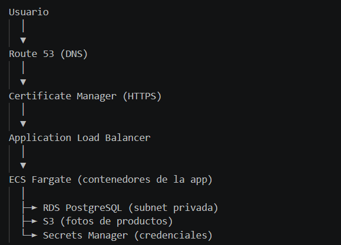

# 03 — Propuesta de infraestructura AWS

## Diagrama

Ver: `diagrams/arquitectura-aws.png`

## Flujo de tráfico

| Servicio | Rol | Por qué |
|---|---|---|
| **ECS Fargate** | Orquestación de contenedores | corre el contenedor sin que tenga que gestionar servidores y escala automaticamente |
| **RDS PostgreSQL** | Base de datos gestionada | AWS administra los parches y los backups de la DB |
| **S3** | Almacenamiento de imagenes | Almacenamiento barato y simple, y no pierdo el contenido si escala  |
| **VPC** | Aisla la red  | la DB va en la subred privada por seguridad ya que hablamos de transacción de dinero y datos confidenciales | 
| **ALB** | Load balancer | Distribuye tráfico entre contenedores |
| **Secrets Manager** | credenciales de la DB |guarda las credenciales encriptadas 
| **Route 53** | DNS | dominio propio, facil de recordar |
| **ACM** | Certificados TLS| para que la app cargue con HTTPS

