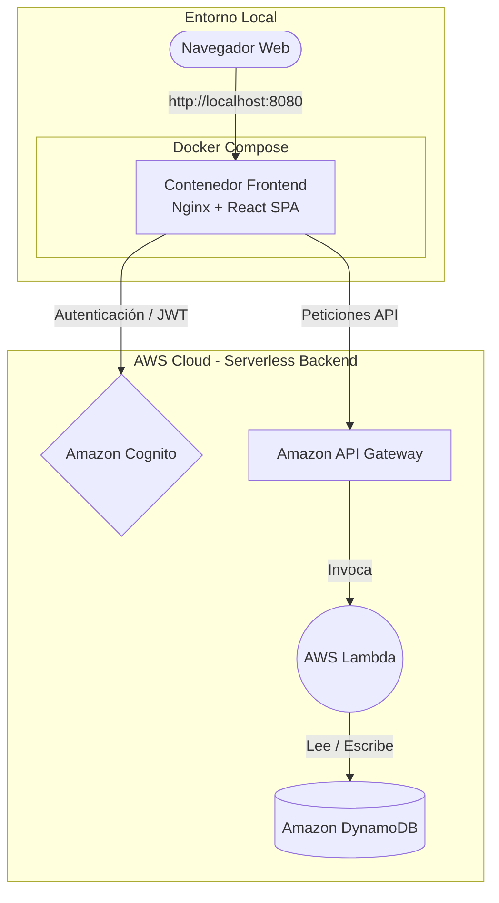

# Arquitectura Local (Docker)

Este documento detalla cómo se ejecuta el proyecto localmente, utilizando contenedores Docker, y cómo este interactúa con la infraestructura desplegada en la nube.

## ¿Cómo corre la aplicación con Docker?

La aplicación utiliza Docker Compose para orquestar la inicialización. Dado que el backend opera bajo una arquitectura 100% Serverless gestionada remotamente en AWS (Cognito, API Gateway, Lambda, DynamoDB), el entorno local se enfoca exclusivamente en la contenedorización del **Frontend**.

- **Servicios (`frontend`):** La imagen de Docker se construye mediante un _Multi-stage build_.
  - **Stage 1 (Node.js):** Instala las dependencias y compila la aplicación de React/Vite (`npm run build`). En este paso, las variables del archivo `.env` se inyectan en el código estático.
  - **Stage 2 (Nginx):** Transfiere los archivos estáticos compilados a un servidor web Nginx, descartando el código fuente y las dependencias pesadas de Node.
- **Puertos:** El servidor Nginx interno expone el puerto `80`. A través del `docker-compose.yml`, este puerto se mapea al puerto `8080` de la máquina anfitriona (_host_), bajo la directiva `8080:80`.

## Instrucciones para levantar la aplicación

Para inicializar el proyecto en tu entorno local, sigue estos pasos:

1. Ingresa a la carpeta `/frontend`.
2. Habilita las variables de entorno duplicando el archivo de plantilla:
   - Renombra o copia `.env.example` a `.env`.
   - _(Nota: El archivo de ejemplo ya contiene las credenciales de lectura y URLs públicas necesarias para interactuar con los recursos Serverless de AWS)._
3. Vuelve a la raíz principal del proyecto (donde se ubica el archivo `docker-compose.yml`).
4. Ejecuta el siguiente comando para construir la imagen e inicializar el contenedor en segundo plano:

   ```bash
   docker-compose up -d --build
   ```

5. Abre tu navegador web e ingresa a: http://localhost:8080

## Diagrama de Conexiones

El siguiente diagrama ilustra cómo el contenedor local interactúa de manera remota con los servicios gestionados de AWS:


