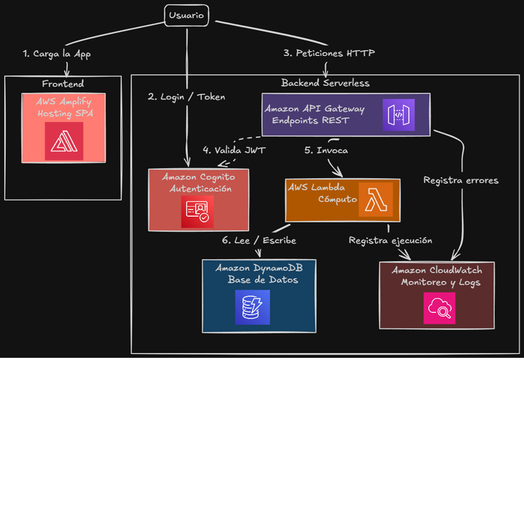

# Propuesta de Arquitectura en AWS (Desplegada)

_Nota: Aunque la consigna indica que no es necesario desplegar la aplicación, esta arquitectura ya se encuentra implementada y 100% operativa en la nube de AWS._

## Servicios de AWS Utilizados y Justificación

La solución está construida bajo un modelo **Serverless** (sin servidor), seleccionado específicamente para optimizar costos (modelo de pago por uso), delegar el mantenimiento de la infraestructura a AWS, y garantizar una escalabilidad automática ante variaciones de tráfico.

### 1. AWS Amplify (Hosting del Frontend)

- **Justificación:** Se utiliza para el alojamiento y despliegue continuo (CI/CD) de la _Single Page Application_ (React/Vite). Amplify facilita la conexión directa con el repositorio, manejando automáticamente la distribución global del contenido estático y la invalidación de caché en las _Edge Locations_, lo que garantiza tiempos de carga mínimos para los adoptantes.

### 2. Amazon Cognito (Seguridad e Identidad)

- **Justificación:** Gestiona la autenticación y el directorio de usuarios (_User Pool_) para los administradores de los refugios. Se eligió porque evita tener que desarrollar y mantener flujos críticos de seguridad (como encriptación de contraseñas, recuperación de cuentas y manejo de tokens JWT) desde cero. Se integra de manera nativa con la capa de red del backend.

### 3. Amazon API Gateway (Capa de Red y Ruteo)

- **Justificación:** Actúa como la puerta de entrada principal para todas las peticiones HTTPS provenientes del frontend. Se eligió porque permite implementar un _Cognito Authorizer_ que rechaza peticiones no autenticadas antes de que lleguen al cómputo, y permite configurar políticas de _Throttling_ (límites de tasa y ráfaga) para mitigar posibles ataques de denegación de servicio (DDoS).

### 4. AWS Lambda (Cómputo)

- **Justificación:** Es el núcleo transaccional del sistema. Las funciones Lambda ejecutan la lógica de negocio (creación de cuentas, generación de landing pages, configuración de perfiles). Su elección se basa en la eficiencia de costos: al ser _event-driven_, el sistema cobra únicamente por los milisegundos de ejecución durante una solicitud, reduciendo el costo a cero ($0.00) cuando la plataforma no recibe tráfico.

### 5. Amazon DynamoDB (Base de Datos)

- **Justificación:** Es una base de datos NoSQL clave-valor y de documentos, totalmente administrada. Se seleccionó por su rendimiento de latencia de un solo dígito de milisegundo y su esquema flexible. Al tratar con perfiles de refugios e identidades de marca, los atributos de los datos pueden evolucionar rápidamente, y un esquema de documentos permite estas iteraciones sin el costo operativo de complejas migraciones de tablas relacionales. Además, se conecta fluidamente con Lambda a través de roles de IAM (mínimo privilegio).

---

## Diagrama de Arquitectura

El esquema visual que representa la topología de red y la interacción entre estos servicios puede verse en la siguiente imagen:

_(Ruta: `diagrams/arquitectura-aws.png`)_
