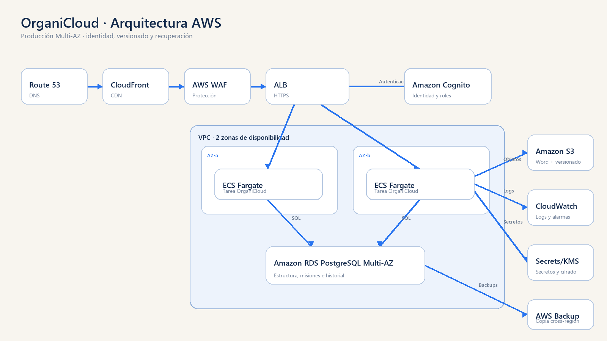

# OrganiCloud — Vanesa Gerantonio

Trabajo práctico final del curso **Arquitectura de Computación en la Nube 2026**.

OrganiCloud es una aplicación web para centralizar el organigrama institucional y el Manual de Misiones y Funciones.



## Motivación personal


OrganiCloud nace para mantener una única fuente de información, reducir tareas repetitivas y facilitar la actualización de la estructura institucional.

## Funcionalidades

- Consulta de un organigrama dinámico.
- Navegación entre unidades y dependencias.
- Búsqueda de áreas por nombre, tipo o misión.
- Administración de misiones y funciones.
- Registro del motivo de cada modificación.
- Historial de versiones.
- Exportación de fichas individuales a Word.
- Exportación del Manual de Misiones y Funciones completo.
- Endpoint `/health` para comprobar la aplicación y PostgreSQL.

## Tecnologías utilizadas

- Python.
- Flask.
- PostgreSQL.
- SQLAlchemy.
- Docker.
- Docker Compose.
- Gunicorn.
- HTML y CSS.
- Draw.io para los diagramas editables.

## Ejecución local

1. Iniciar Docker Desktop.
2. Abrir una terminal dentro de la carpeta `app`.
3. Ejecutar:

```powershell
docker compose up --build